# Real-time Stream Processing with Amazon Managed Service for Apache Flink

## 📌 Project Overview
This project demonstrates how to build and monitor a **real-time stream processing application** using **Amazon Managed Service for Apache Flink**.  
The use case simulates ingesting data streams, processing them with Apache Flink, extending the program with time windows and aggregation, and visualizing results with OpenSearch.

Through this project, I practiced:

- Deploying environments using **AWS CloudFormation**
- Ingesting streaming data with **Amazon Kinesis Data Streams**
- Running a **Java producer** to generate real-time event data
- Developing and deploying a **Flink application**
- Extending Flink with **event-time semantics** and **aggregation**
- Integrating with **OpenSearch** for indexing and dashboards
- Monitoring application health with **CloudWatch Metrics** and the **Flink Dashboard**
- Observing job execution with **Directed Acyclic Graphs (DAGs)**

---

## 🏗 Architecture
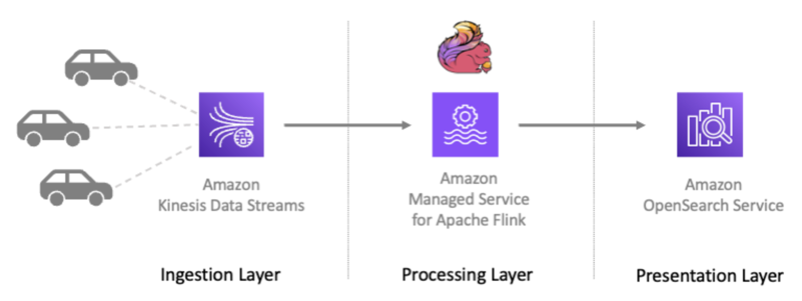

**Workflow:**
1. CloudFormation provisions Amazon Kinesis Data Streams, IAM roles, and networking.
2. A **Java producer** sends events into Kinesis.
3. **Amazon Managed Service for Apache Flink** consumes and processes the data.
4. Flink program is extended with parameters, time windows, and event-time semantics.
5. Processed data is written to **Amazon OpenSearch Service** for visualization.
6. Metrics and logs are monitored with **CloudWatch** and the **Flink Dashboard**.

---

## 🛠 Technologies Used
- **Amazon Kinesis Data Streams** – Real-time ingestion
- **Amazon Managed Service for Apache Flink** – Stream processing
- **Amazon OpenSearch Service** – Data indexing and dashboards
- **Amazon CloudWatch** – Application metrics & monitoring
- **AWS CloudFormation** – Automated provisioning
- **Amazon IAM** – Role-based access control
- **Java Producer** – Event data generator

---

## 🚀 Implementation Steps

### 1. Environment Setup with CloudFormation
Provisioned stack resources for Kinesis streams, IAM roles, and networking.

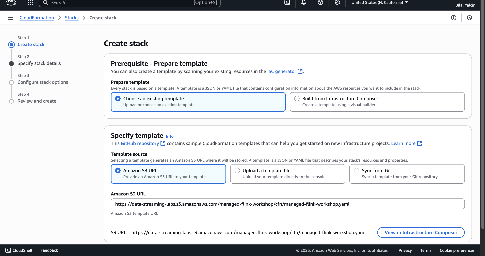  
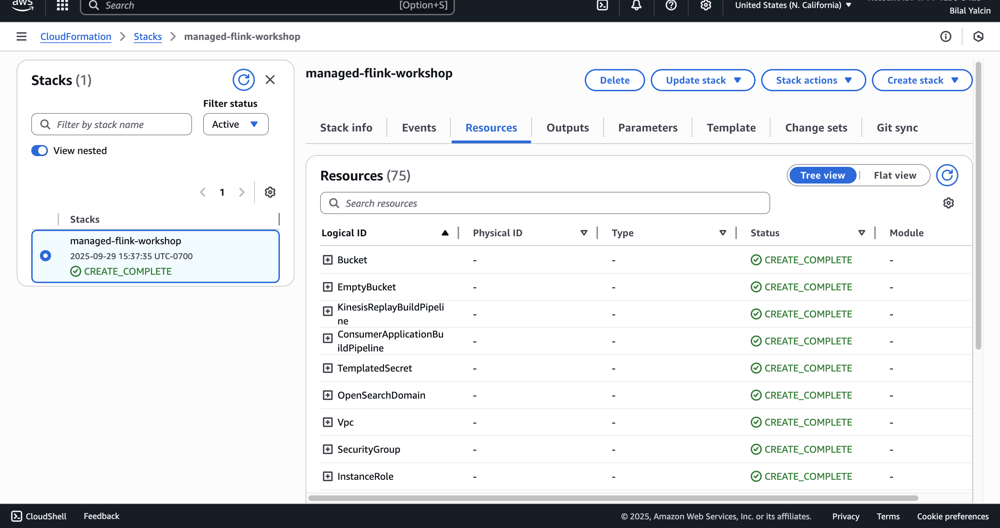

---

### 2. Data Ingestion with Kinesis & Java Producer
Created a Kinesis stream and launched a Java producer to send events in real time.

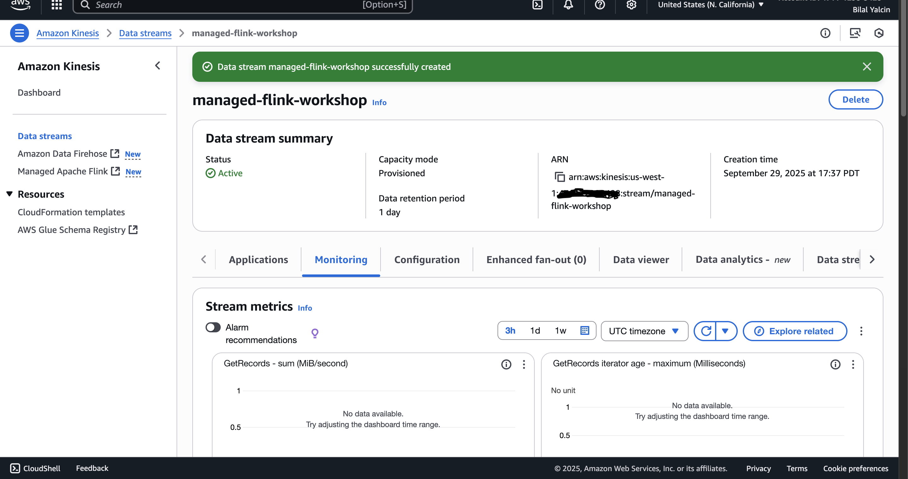  
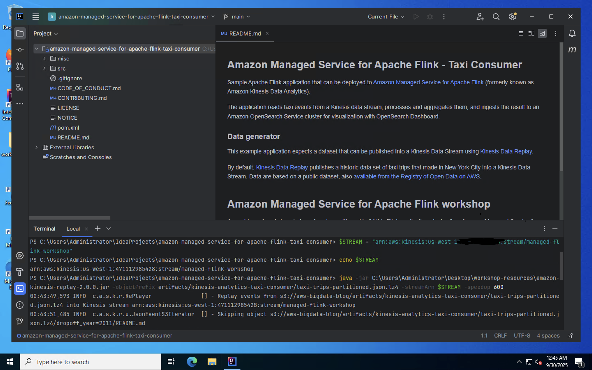

---

### 3. Flink Application Deployment
Developed and deployed a Flink application on **Amazon Managed Service for Apache Flink**.

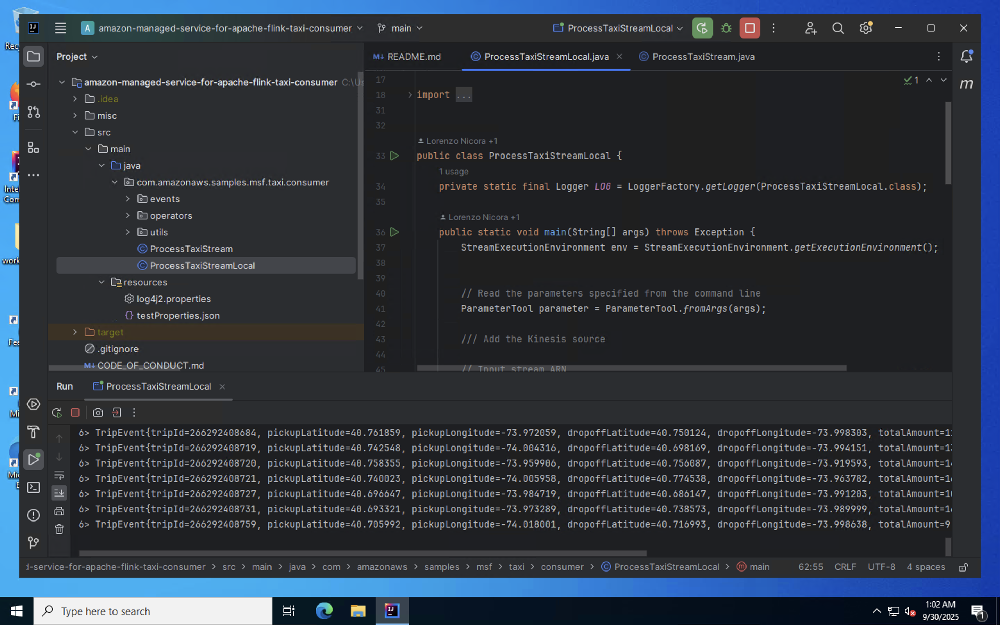  
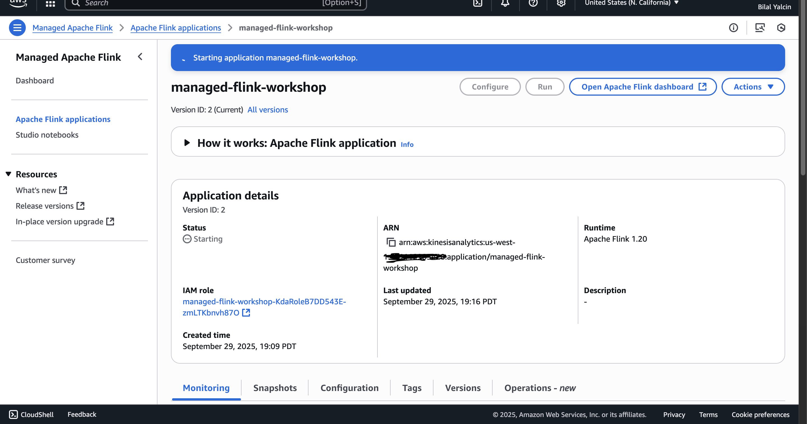

---

### 4. Extend the Flink Program
Enhanced the application with **parameters, event-time semantics, time windows, and aggregations**.

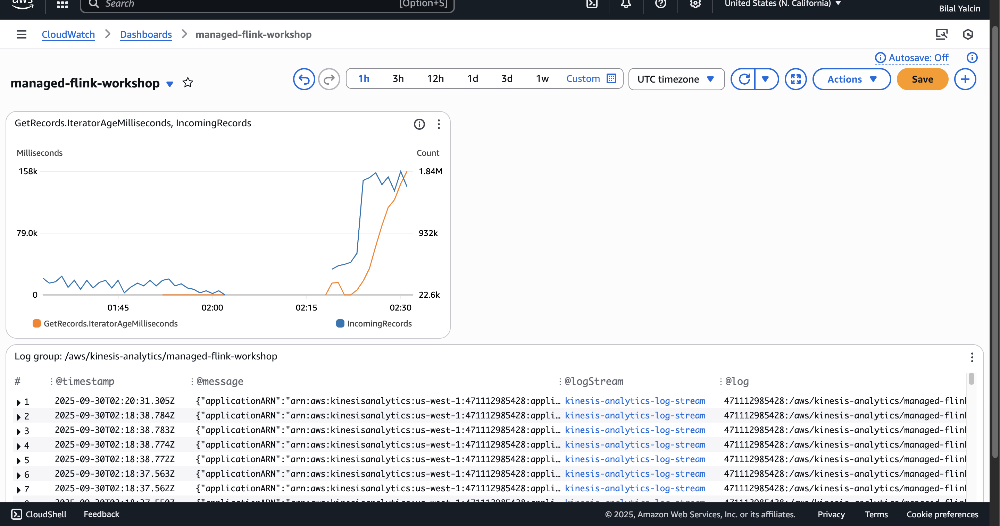  
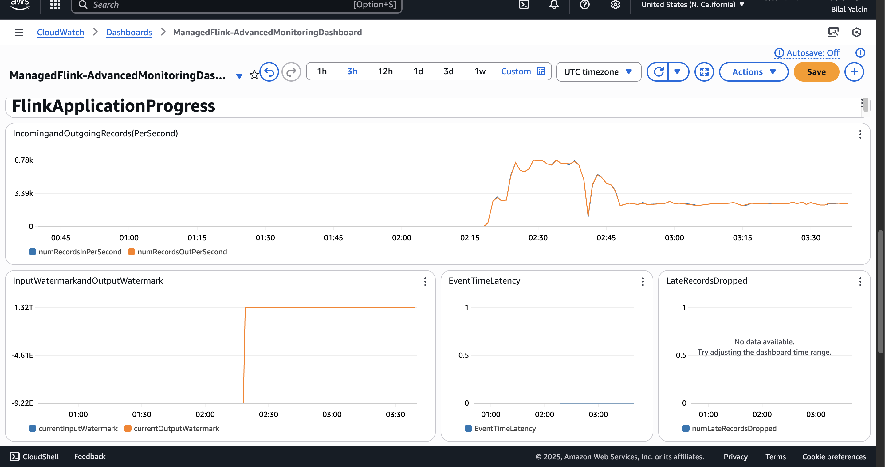

---

### 5. OpenSearch Integration
Added an **OpenSearch sink** to store processed data and created indices for visualization.

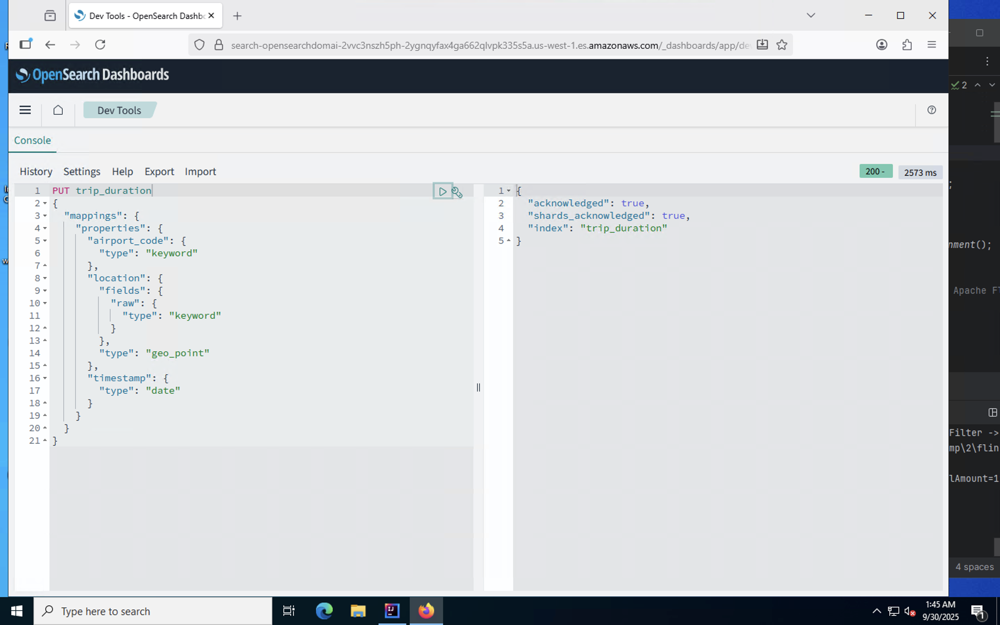  
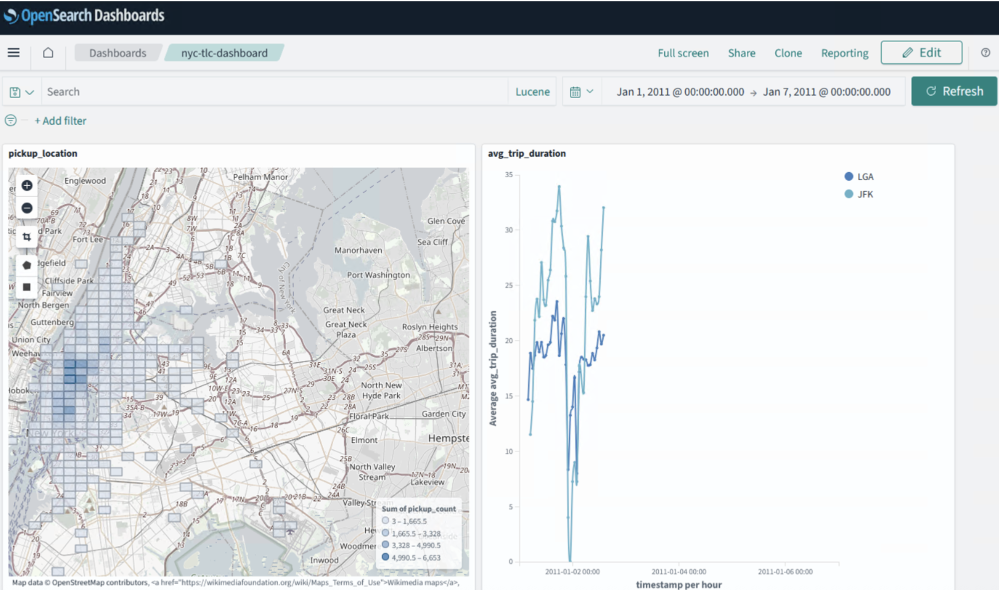

---

### 6. Monitoring & Observability
Monitored performance and resource utilization with **CloudWatch Metrics** and the **Flink Dashboard**.

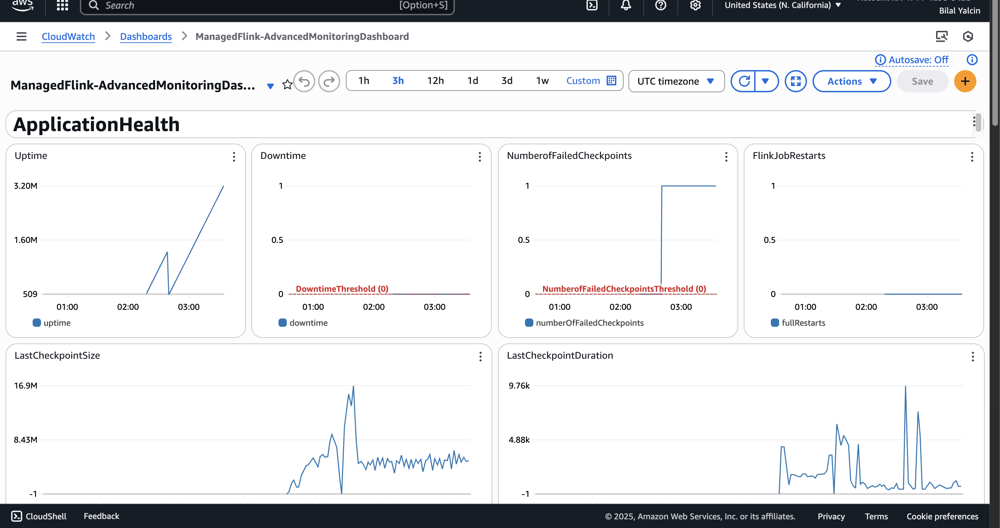  
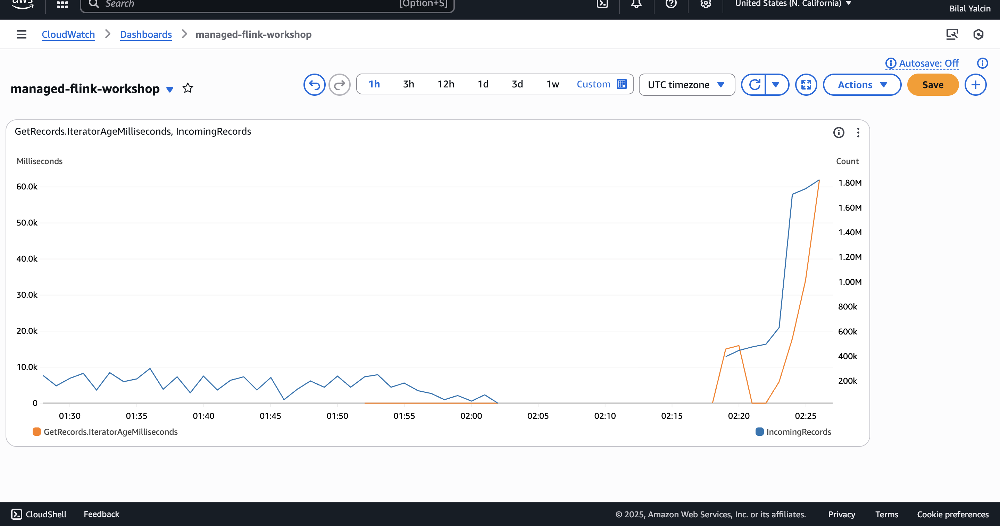  
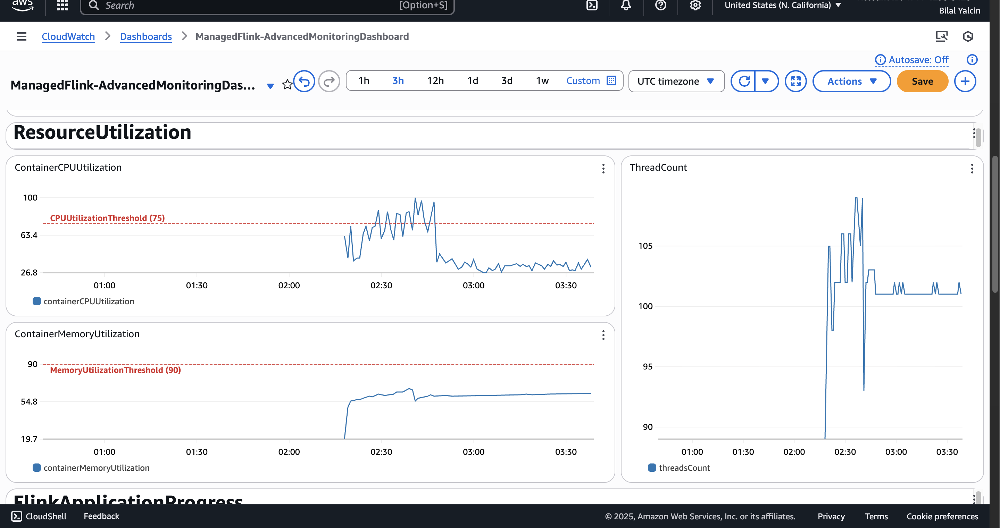  
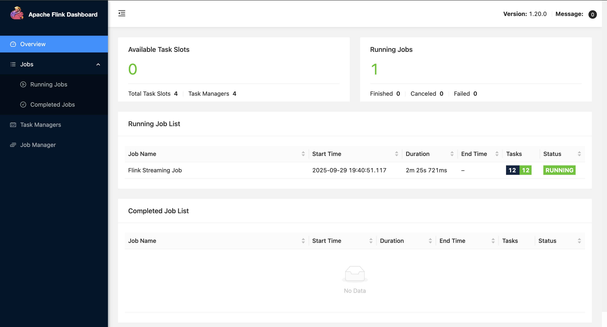

---

### 7. DAG & Metrics Analysis
Visualized the job graph and validated data flow using the DAG and Kinesis metrics.

.png)  
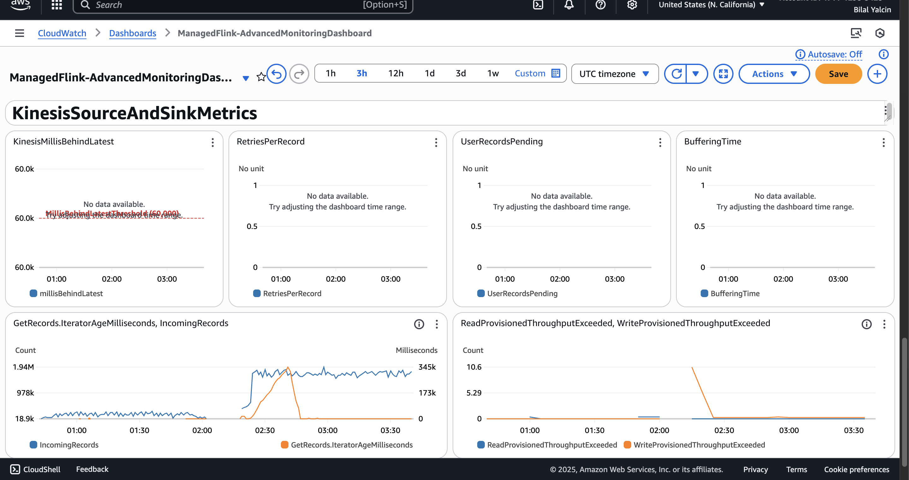

---

## 🧹 Cleanup
To avoid ongoing AWS charges:
- Stopped the Flink application
- Deleted CloudFormation stack
- Removed Kinesis streams and OpenSearch indices

---

## 🔗 References
- [Amazon Managed Service for Apache Flink Documentation](https://docs.aws.amazon.com/managed-flink/)  
- [AWS Workshop Studio](https://catalog.workshops.aws/managed-flink/en-US)

---

## 🏷️ Tags
`aws` `apache-flink` `real-time-streaming` `kinesis` `cloudwatch` `opensearch`
